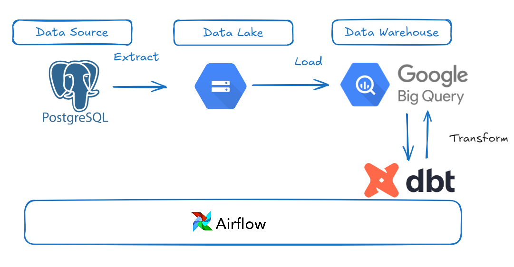
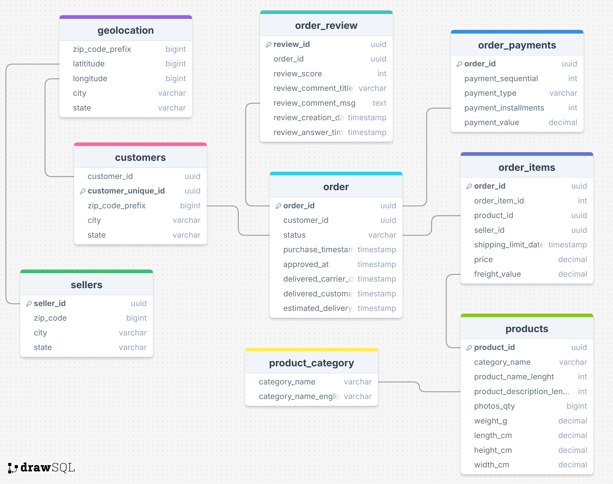

# Project Overview

This project develops an end to end ETL process using Olist dataset from Kaggle to help data end users answer some analytical questions. The project used Postgresql, Docker, Docker Compose, Airflow, dbt and Bigquery in developing the pipepline.



## Project Part One - EXtraction and Loadin Setup

## Step 1 : Data Ingestion into PostgreSQL Database

- 1. Download the Dataset:
  - Downloaded the Brazilian E-Commerce dataset from Kaggle.
  - directory : data

- 2. Setup Postgre(Source) Database:
  - Setup Postgresql using Docker with a database named ecommerce.
  - directory : airflow/docker-compose.yml

- 3. Created  Schema and Tables:
  - Create tables in the PostgreSQL database corresponding to each CSV file in the dataset.
  - Ingest Data:
  - directory : infra_setup/init.sql



## Step 2 : Setup Airflow for Ochestraion

- 1. Setup airflow:
  - Setup airflow with docker to handle the extract and loading pipeline
  - Added the postgres database as source-db in the docker-compose file (provide your own username and password).

- 2. Setup dags:
  - Dags was setup to extract data from the postgres(source) database and load into bigquery for each dataset
  - directory : airflow/dags

## Step 3 : Deploy Airflow

Run command below

   ```bash
  pip install requirement.txt

  ```

To deploy the airflow project:

- Change directory to airflow

  ```bash
  cd airflow

  ```

- Spin up airflow :

   ``bash
  docker-compose up

```

- Setup Connections and Variables:
  - visit [localhost:](http://localhost:8080/)
  - Set up the postgres database connection
    - port: 5432
  - Setup google cloud connection
  - Setup variables specified in the dags
- Refresh the page
- Trigger the dags

## Part Two : Transformation with DBT

### Step 1 : RUN DBT
Change directory to dbt-olist
 ```bash
  cd  dbt-olist 

  ```

### Step 2:  RUN Project

 ```bash
  dbt run  

  ```

## DBT-OLIST Model structure

- models:
  - source:
    - final
    - intermediate
    - staging

### Answer to analytic questions

Answers to the analytic question can be found in answer/answer.txt
